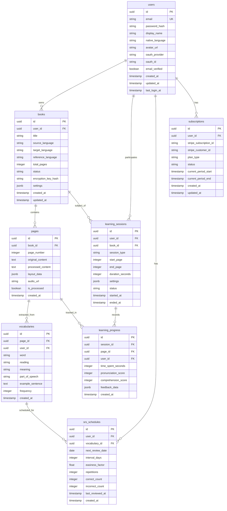

# Database Schema

## 1. Entity-Relationship Diagram



---

## 2. Table Definitions

### 2.1 users

User accounts and authentication.

| Column | Type | Constraints | Description |
|--------|------|-------------|-------------|
| `id` | `UUID` | PK, DEFAULT gen_random_uuid() | Unique identifier |
| `email` | `VARCHAR(255)` | UNIQUE, NOT NULL | Login email |
| `password_hash` | `VARCHAR(255)` | NULL | Argon2id hash (null for OAuth users) |
| `display_name` | `VARCHAR(100)` | NOT NULL | Display name |
| `native_language` | `VARCHAR(10)` | NOT NULL, DEFAULT 'en' | ISO 639-1 code |
| `avatar_url` | `TEXT` | NULL | Profile picture URL |
| `oauth_provider` | `VARCHAR(50)` | NULL | 'google', 'github', etc. |
| `oauth_id` | `VARCHAR(255)` | NULL | Provider's user ID |
| `email_verified` | `BOOLEAN` | DEFAULT FALSE | Email verification status |
| `created_at` | `TIMESTAMPTZ` | DEFAULT NOW() | Account creation |
| `updated_at` | `TIMESTAMPTZ` | DEFAULT NOW() | Last update |
| `last_login_at` | `TIMESTAMPTZ` | NULL | Last login timestamp |

**Indexes:**
```sql
CREATE UNIQUE INDEX idx_users_email ON users(email);
CREATE UNIQUE INDEX idx_users_oauth ON users(oauth_provider, oauth_id) WHERE oauth_provider IS NOT NULL;
```

### 2.2 books

Uploaded textbooks and their metadata.

| Column | Type | Constraints | Description |
|--------|------|-------------|-------------|
| `id` | `UUID` | PK | Unique identifier |
| `user_id` | `UUID` | FK users(id) ON DELETE CASCADE | Owner |
| `title` | `VARCHAR(255)` | NOT NULL | Book title |
| `source_language` | `VARCHAR(10)` | NOT NULL | Original language |
| `target_language` | `VARCHAR(10)` | NOT NULL | Language to learn |
| `reference_language` | `VARCHAR(10)` | NULL | Intermediate language |
| `total_pages` | `INTEGER` | DEFAULT 0 | Page count |
| `status` | `VARCHAR(20)` | DEFAULT 'pending' | 'pending', 'processing', 'ready', 'error' |
| `encryption_key_hash` | `VARCHAR(255)` | NULL | For E2E encryption |
| `settings` | `JSONB` | DEFAULT '{}' | TTS settings, preferences |
| `created_at` | `TIMESTAMPTZ` | DEFAULT NOW() | Upload time |
| `updated_at` | `TIMESTAMPTZ` | DEFAULT NOW() | Last update |

**Indexes:**
```sql
CREATE INDEX idx_books_user_id ON books(user_id);
CREATE INDEX idx_books_status ON books(status);
CREATE INDEX idx_books_created_at ON books(user_id, created_at DESC);
```

### 2.3 pages

Individual pages with OCR results.

| Column | Type | Constraints | Description |
|--------|------|-------------|-------------|
| `id` | `UUID` | PK | Unique identifier |
| `book_id` | `UUID` | FK books(id) ON DELETE CASCADE | Parent book |
| `page_number` | `INTEGER` | NOT NULL | 1-indexed page number |
| `original_content` | `TEXT` | NULL | Raw OCR text |
| `processed_content` | `TEXT` | NULL | Cleaned/structured text |
| `layout_data` | `JSONB` | NULL | Text positions, bounding boxes |
| `audio_url` | `TEXT` | NULL | Pre-generated TTS audio |
| `is_processed` | `BOOLEAN` | DEFAULT FALSE | OCR complete flag |
| `created_at` | `TIMESTAMPTZ` | DEFAULT NOW() | Creation time |

**Indexes:**
```sql
CREATE UNIQUE INDEX idx_pages_book_page ON pages(book_id, page_number);
CREATE INDEX idx_pages_book_id ON pages(book_id);
```

### 2.4 vocabularies

Extracted vocabulary words.

| Column | Type | Constraints | Description |
|--------|------|-------------|-------------|
| `id` | `UUID` | PK | Unique identifier |
| `page_id` | `UUID` | FK pages(id) ON DELETE CASCADE | Source page |
| `user_id` | `UUID` | FK users(id) ON DELETE CASCADE | Owner |
| `word` | `VARCHAR(255)` | NOT NULL | The vocabulary word |
| `reading` | `VARCHAR(255)` | NULL | Pronunciation guide |
| `meaning` | `TEXT` | NOT NULL | Definition/translation |
| `part_of_speech` | `VARCHAR(50)` | NULL | noun, verb, etc. |
| `example_sentence` | `TEXT` | NULL | Usage example |
| `frequency` | `INTEGER` | DEFAULT 1 | Occurrence count |
| `created_at` | `TIMESTAMPTZ` | DEFAULT NOW() | Creation time |

**Indexes:**
```sql
CREATE INDEX idx_vocabularies_user_id ON vocabularies(user_id);
CREATE INDEX idx_vocabularies_page_id ON vocabularies(page_id);
CREATE INDEX idx_vocabularies_word ON vocabularies(user_id, word);
```

### 2.5 srs_schedules

Spaced Repetition System scheduling (SM-2 algorithm).

| Column | Type | Constraints | Description |
|--------|------|-------------|-------------|
| `id` | `UUID` | PK | Unique identifier |
| `user_id` | `UUID` | FK users(id) ON DELETE CASCADE | Learner |
| `vocabulary_id` | `UUID` | FK vocabularies(id) ON DELETE CASCADE | Word to review |
| `next_review_date` | `DATE` | NOT NULL | Next scheduled review |
| `interval_days` | `INTEGER` | DEFAULT 1 | Days until next review |
| `easiness_factor` | `REAL` | DEFAULT 2.5 | SM-2 EF (1.3-2.5) |
| `repetitions` | `INTEGER` | DEFAULT 0 | Successful review count |
| `correct_count` | `INTEGER` | DEFAULT 0 | Total correct answers |
| `incorrect_count` | `INTEGER` | DEFAULT 0 | Total incorrect answers |
| `last_reviewed_at` | `TIMESTAMPTZ` | NULL | Last review time |
| `created_at` | `TIMESTAMPTZ` | DEFAULT NOW() | Schedule creation |

**Indexes:**
```sql
CREATE UNIQUE INDEX idx_srs_user_vocab ON srs_schedules(user_id, vocabulary_id);
CREATE INDEX idx_srs_next_review ON srs_schedules(user_id, next_review_date);
CREATE INDEX idx_srs_due_today ON srs_schedules(user_id, next_review_date) WHERE next_review_date <= CURRENT_DATE;
```

### 2.6 learning_sessions

Learning session tracking.

| Column | Type | Constraints | Description |
|--------|------|-------------|-------------|
| `id` | `UUID` | PK | Unique identifier |
| `user_id` | `UUID` | FK users(id) ON DELETE CASCADE | Learner |
| `book_id` | `UUID` | FK books(id) ON DELETE SET NULL | Study material |
| `session_type` | `VARCHAR(50)` | NOT NULL | 'page_by_page', 'teacher_mode', 'review' |
| `start_page` | `INTEGER` | NULL | Starting page number |
| `end_page` | `INTEGER` | NULL | Ending page number |
| `duration_seconds` | `INTEGER` | DEFAULT 0 | Total session duration |
| `settings` | `JSONB` | DEFAULT '{}' | Session-specific settings |
| `status` | `VARCHAR(20)` | DEFAULT 'active' | 'active', 'paused', 'completed', 'abandoned' |
| `started_at` | `TIMESTAMPTZ` | DEFAULT NOW() | Session start |
| `ended_at` | `TIMESTAMPTZ` | NULL | Session end |

**Indexes:**
```sql
CREATE INDEX idx_sessions_user_id ON learning_sessions(user_id);
CREATE INDEX idx_sessions_user_recent ON learning_sessions(user_id, started_at DESC);
CREATE INDEX idx_sessions_book_id ON learning_sessions(book_id);
```

### 2.7 learning_progress

Per-page learning metrics.

| Column | Type | Constraints | Description |
|--------|------|-------------|-------------|
| `id` | `UUID` | PK | Unique identifier |
| `session_id` | `UUID` | FK learning_sessions(id) ON DELETE CASCADE | Parent session |
| `page_id` | `UUID` | FK pages(id) ON DELETE CASCADE | Studied page |
| `user_id` | `UUID` | FK users(id) ON DELETE CASCADE | Learner |
| `time_spent_seconds` | `INTEGER` | DEFAULT 0 | Time on page |
| `pronunciation_score` | `INTEGER` | NULL | STT score (0-100) |
| `comprehension_score` | `INTEGER` | NULL | Quiz score (0-100) |
| `feedback_data` | `JSONB` | NULL | Detailed AI feedback |
| `created_at` | `TIMESTAMPTZ` | DEFAULT NOW() | Record creation |

**Indexes:**
```sql
CREATE INDEX idx_progress_session_id ON learning_progress(session_id);
CREATE INDEX idx_progress_user_page ON learning_progress(user_id, page_id);
```

### 2.8 subscriptions

Stripe subscription management.

| Column | Type | Constraints | Description |
|--------|------|-------------|-------------|
| `id` | `UUID` | PK | Unique identifier |
| `user_id` | `UUID` | FK users(id) ON DELETE CASCADE | Subscriber |
| `stripe_subscription_id` | `VARCHAR(255)` | UNIQUE, NOT NULL | Stripe sub ID |
| `stripe_customer_id` | `VARCHAR(255)` | NOT NULL | Stripe customer ID |
| `plan_type` | `VARCHAR(50)` | NOT NULL | 'free', 'premium_monthly', 'premium_yearly' |
| `status` | `VARCHAR(50)` | NOT NULL | 'active', 'canceled', 'past_due', 'trialing' |
| `current_period_start` | `TIMESTAMPTZ` | NOT NULL | Billing period start |
| `current_period_end` | `TIMESTAMPTZ` | NOT NULL | Billing period end |
| `created_at` | `TIMESTAMPTZ` | DEFAULT NOW() | Subscription creation |
| `updated_at` | `TIMESTAMPTZ` | DEFAULT NOW() | Last update |

**Indexes:**
```sql
CREATE UNIQUE INDEX idx_subs_stripe_id ON subscriptions(stripe_subscription_id);
CREATE INDEX idx_subs_user_id ON subscriptions(user_id);
CREATE INDEX idx_subs_status ON subscriptions(user_id, status);
```

---

## 3. Index Strategy

### 3.1 Primary Access Patterns

| Pattern | Table | Index |
|---------|-------|-------|
| User login by email | `users` | `idx_users_email` |
| OAuth lookup | `users` | `idx_users_oauth` |
| User's books list | `books` | `idx_books_created_at` |
| Book pages ordered | `pages` | `idx_pages_book_page` |
| Due vocabulary reviews | `srs_schedules` | `idx_srs_due_today` |
| Recent sessions | `learning_sessions` | `idx_sessions_user_recent` |

### 3.2 Partial Indexes

For frequently filtered queries:

```sql
-- Only pending OCR jobs
CREATE INDEX idx_books_pending ON books(created_at)
    WHERE status = 'pending';

-- Only active sessions
CREATE INDEX idx_sessions_active ON learning_sessions(user_id, started_at)
    WHERE status = 'active';

-- Vocabulary with SRS enabled
CREATE INDEX idx_vocab_with_srs ON vocabularies(user_id, created_at)
    WHERE id IN (SELECT vocabulary_id FROM srs_schedules);
```

### 3.3 JSONB Indexes

For querying settings and metadata:

```sql
-- Book TTS language preference
CREATE INDEX idx_books_tts_lang ON books USING gin ((settings->'tts_language'));

-- Session type filtering
CREATE INDEX idx_sessions_settings ON learning_sessions USING gin (settings);
```

---

## 4. reinhardt-db Model Definitions

### 4.1 User Model

```rust
use reinhardt_db::prelude::*;
use argon2::{Argon2, PasswordHash, PasswordVerifier, PasswordHasher};
use argon2::password_hash::SaltString;

#[derive(Model, Debug, Clone)]
#[model(table_name = "users")]
pub struct User {
    #[pk]
    pub id: Uuid,

    #[unique]
    pub email: String,

    pub password_hash: Option<String>,
    pub display_name: String,

    #[default("en")]
    pub native_language: String,

    pub avatar_url: Option<String>,
    pub oauth_provider: Option<String>,
    pub oauth_id: Option<String>,

    #[default(false)]
    pub email_verified: bool,

    #[auto_now_add]
    pub created_at: DateTime<Utc>,

    #[auto_now]
    pub updated_at: DateTime<Utc>,

    pub last_login_at: Option<DateTime<Utc>>,
}

impl User {
    pub fn verify_password(&self, password: &str) -> bool {
        match &self.password_hash {
            Some(hash) => {
                let parsed = PasswordHash::new(hash).expect("invalid hash");
                Argon2::default().verify_password(password.as_bytes(), &parsed).is_ok()
            }
            None => false,
        }
    }

    pub fn set_password(&mut self, password: &str) {
        let salt = SaltString::generate(&mut rand::thread_rng());
        let hash = Argon2::default()
            .hash_password(password.as_bytes(), &salt)
            .expect("hashing failed")
            .to_string();
        self.password_hash = Some(hash);
    }

    pub async fn find_by_email(
        conn: &DatabaseConnection,
        email: &str,
    ) -> Result<Option<Self>, DbError> {
        Self::query()
            .filter(UserColumn::Email.eq(email))
            .one(conn)
            .await
    }

    pub async fn find_by_oauth(
        conn: &DatabaseConnection,
        provider: &str,
        oauth_id: &str,
    ) -> Result<Option<Self>, DbError> {
        Self::query()
            .filter(UserColumn::OauthProvider.eq(provider))
            .filter(UserColumn::OauthId.eq(oauth_id))
            .one(conn)
            .await
    }
}
```

### 4.2 Book Model

```rust
use reinhardt_db::prelude::*;
use serde::{Deserialize, Serialize};

#[derive(Debug, Clone, Copy, PartialEq, Eq, Serialize, Deserialize)]
#[serde(rename_all = "snake_case")]
pub enum BookStatus {
    Pending,
    Processing,
    Ready,
    Error,
}

#[derive(Debug, Clone, Serialize, Deserialize, Default)]
pub struct BookSettings {
    pub tts_language: Option<String>,
    pub tts_speed: Option<f32>,
    pub auto_play: Option<bool>,
}

#[derive(Model, Debug, Clone)]
#[model(table_name = "books")]
pub struct Book {
    #[pk]
    pub id: Uuid,

    #[foreign_key(User)]
    pub user_id: Uuid,

    pub title: String,
    pub source_language: String,
    pub target_language: String,
    pub reference_language: Option<String>,

    #[default(0)]
    pub total_pages: i32,

    #[default(BookStatus::Pending)]
    pub status: BookStatus,

    pub encryption_key_hash: Option<String>,

    #[json]
    #[default(BookSettings::default())]
    pub settings: BookSettings,

    #[auto_now_add]
    pub created_at: DateTime<Utc>,

    #[auto_now]
    pub updated_at: DateTime<Utc>,
}

impl Book {
    pub async fn find_by_user(
        conn: &DatabaseConnection,
        user_id: Uuid,
    ) -> Result<Vec<Self>, DbError> {
        Self::query()
            .filter(BookColumn::UserId.eq(user_id))
            .order_by(BookColumn::CreatedAt, Order::Desc)
            .all(conn)
            .await
    }

    pub async fn find_ready_books(
        conn: &DatabaseConnection,
        user_id: Uuid,
    ) -> Result<Vec<Self>, DbError> {
        Self::query()
            .filter(BookColumn::UserId.eq(user_id))
            .filter(BookColumn::Status.eq(BookStatus::Ready))
            .order_by(BookColumn::UpdatedAt, Order::Desc)
            .all(conn)
            .await
    }
}
```

### 4.3 SRS Schedule Model (SM-2 Algorithm)

```rust
use reinhardt_db::prelude::*;

#[derive(Model, Debug, Clone)]
#[model(table_name = "srs_schedules")]
pub struct SrsSchedule {
    #[pk]
    pub id: Uuid,

    #[foreign_key(User)]
    pub user_id: Uuid,

    #[foreign_key(Vocabulary)]
    pub vocabulary_id: Uuid,

    pub next_review_date: NaiveDate,

    #[default(1)]
    pub interval_days: i32,

    #[default(2.5)]
    pub easiness_factor: f32,

    #[default(0)]
    pub repetitions: i32,

    #[default(0)]
    pub correct_count: i32,

    #[default(0)]
    pub incorrect_count: i32,

    pub last_reviewed_at: Option<DateTime<Utc>>,

    #[auto_now_add]
    pub created_at: DateTime<Utc>,
}

impl SrsSchedule {
    /// SM-2 algorithm implementation
    /// quality: 0-5 (0-2 = fail, 3-5 = pass)
    pub fn update_after_review(&mut self, quality: u8) {
        let q = quality.min(5) as f32;

        // Update easiness factor
        self.easiness_factor = (self.easiness_factor
            + (0.1 - (5.0 - q) * (0.08 + (5.0 - q) * 0.02)))
            .max(1.3);

        if quality >= 3 {
            // Correct answer
            self.correct_count += 1;
            self.repetitions += 1;

            self.interval_days = match self.repetitions {
                1 => 1,
                2 => 6,
                _ => (self.interval_days as f32 * self.easiness_factor).round() as i32,
            };
        } else {
            // Incorrect answer
            self.incorrect_count += 1;
            self.repetitions = 0;
            self.interval_days = 1;
        }

        self.next_review_date = Utc::now().date_naive() + Duration::days(self.interval_days as i64);
        self.last_reviewed_at = Some(Utc::now());
    }

    pub async fn find_due_reviews(
        conn: &DatabaseConnection,
        user_id: Uuid,
        limit: i64,
    ) -> Result<Vec<Self>, DbError> {
        Self::query()
            .filter(SrsScheduleColumn::UserId.eq(user_id))
            .filter(SrsScheduleColumn::NextReviewDate.lte(Utc::now().date_naive()))
            .order_by(SrsScheduleColumn::NextReviewDate, Order::Asc)
            .limit(limit)
            .all(conn)
            .await
    }
}
```

### 4.4 Learning Session Model

```rust
use reinhardt_db::prelude::*;
use serde::{Deserialize, Serialize};

#[derive(Debug, Clone, Copy, PartialEq, Eq, Serialize, Deserialize)]
#[serde(rename_all = "snake_case")]
pub enum SessionType {
    PageByPage,
    TeacherMode,
    Review,
}

#[derive(Debug, Clone, Copy, PartialEq, Eq, Serialize, Deserialize)]
#[serde(rename_all = "snake_case")]
pub enum SessionStatus {
    Active,
    Paused,
    Completed,
    Abandoned,
}

#[derive(Debug, Clone, Serialize, Deserialize, Default)]
pub struct SessionSettings {
    pub tts_speed: f32,
    pub page_interval: u32,       // seconds between pages
    pub repeat_count: u32,        // times to repeat each page
    pub include_translation: bool,
    pub include_vocabulary: bool,
    pub include_grammar: bool,
}

#[derive(Model, Debug, Clone)]
#[model(table_name = "learning_sessions")]
pub struct LearningSession {
    #[pk]
    pub id: Uuid,

    #[foreign_key(User)]
    pub user_id: Uuid,

    #[foreign_key(Book)]
    pub book_id: Option<Uuid>,

    pub session_type: SessionType,
    pub start_page: Option<i32>,
    pub end_page: Option<i32>,

    #[default(0)]
    pub duration_seconds: i32,

    #[json]
    #[default(SessionSettings::default())]
    pub settings: SessionSettings,

    #[default(SessionStatus::Active)]
    pub status: SessionStatus,

    #[auto_now_add]
    pub started_at: DateTime<Utc>,

    pub ended_at: Option<DateTime<Utc>>,
}

impl LearningSession {
    pub async fn get_active_session(
        conn: &DatabaseConnection,
        user_id: Uuid,
    ) -> Result<Option<Self>, DbError> {
        Self::query()
            .filter(LearningSessionColumn::UserId.eq(user_id))
            .filter(LearningSessionColumn::Status.eq(SessionStatus::Active))
            .order_by(LearningSessionColumn::StartedAt, Order::Desc)
            .one(conn)
            .await
    }

    pub fn complete(&mut self) {
        self.status = SessionStatus::Completed;
        self.ended_at = Some(Utc::now());
        self.duration_seconds = (Utc::now() - self.started_at).num_seconds() as i32;
    }
}
```

---

## 5. Migration Example

```sql
-- migrations/0001_initial.sql

-- Enable UUID extension
CREATE EXTENSION IF NOT EXISTS "pgcrypto";

-- Users table
CREATE TABLE users (
    id UUID PRIMARY KEY DEFAULT gen_random_uuid(),
    email VARCHAR(255) NOT NULL UNIQUE,
    password_hash VARCHAR(255),
    display_name VARCHAR(100) NOT NULL,
    native_language VARCHAR(10) NOT NULL DEFAULT 'en',
    avatar_url TEXT,
    oauth_provider VARCHAR(50),
    oauth_id VARCHAR(255),
    email_verified BOOLEAN DEFAULT FALSE,
    created_at TIMESTAMPTZ DEFAULT NOW(),
    updated_at TIMESTAMPTZ DEFAULT NOW(),
    last_login_at TIMESTAMPTZ
);

CREATE UNIQUE INDEX idx_users_oauth ON users(oauth_provider, oauth_id)
    WHERE oauth_provider IS NOT NULL;

-- Books table
CREATE TABLE books (
    id UUID PRIMARY KEY DEFAULT gen_random_uuid(),
    user_id UUID NOT NULL REFERENCES users(id) ON DELETE CASCADE,
    title VARCHAR(255) NOT NULL,
    source_language VARCHAR(10) NOT NULL,
    target_language VARCHAR(10) NOT NULL,
    reference_language VARCHAR(10),
    total_pages INTEGER DEFAULT 0,
    status VARCHAR(20) DEFAULT 'pending',
    encryption_key_hash VARCHAR(255),
    settings JSONB DEFAULT '{}',
    created_at TIMESTAMPTZ DEFAULT NOW(),
    updated_at TIMESTAMPTZ DEFAULT NOW()
);

CREATE INDEX idx_books_user_id ON books(user_id);
CREATE INDEX idx_books_created_at ON books(user_id, created_at DESC);

-- Trigger for updated_at
CREATE OR REPLACE FUNCTION update_updated_at()
RETURNS TRIGGER AS $$
BEGIN
    NEW.updated_at = NOW();
    RETURN NEW;
END;
$$ LANGUAGE plpgsql;

CREATE TRIGGER users_updated_at
    BEFORE UPDATE ON users
    FOR EACH ROW EXECUTE FUNCTION update_updated_at();

CREATE TRIGGER books_updated_at
    BEFORE UPDATE ON books
    FOR EACH ROW EXECUTE FUNCTION update_updated_at();

-- Additional tables follow the same pattern...
```

---

## References

- [System Architecture](system_architecture.md)
- [API Specification](api_specification.md)
- [Requirements Definition](../requirements_definition.md)
- [SeaQuery Documentation](https://www.sea-ql.org/SeaQuery/)
