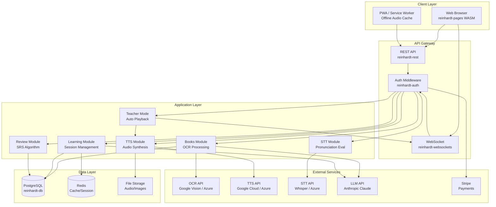
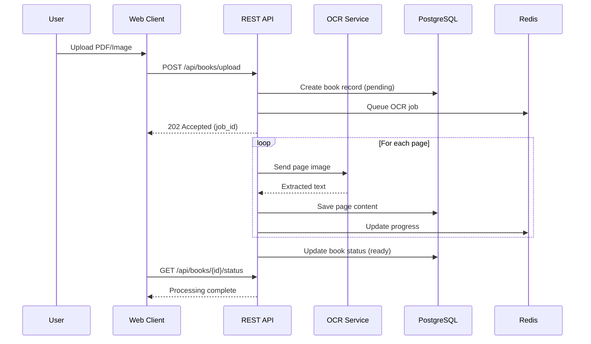
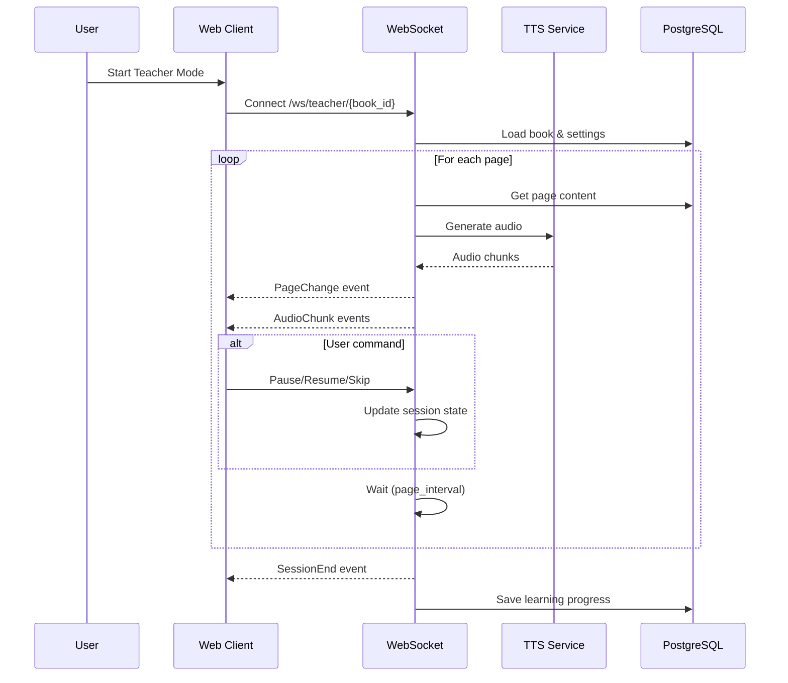
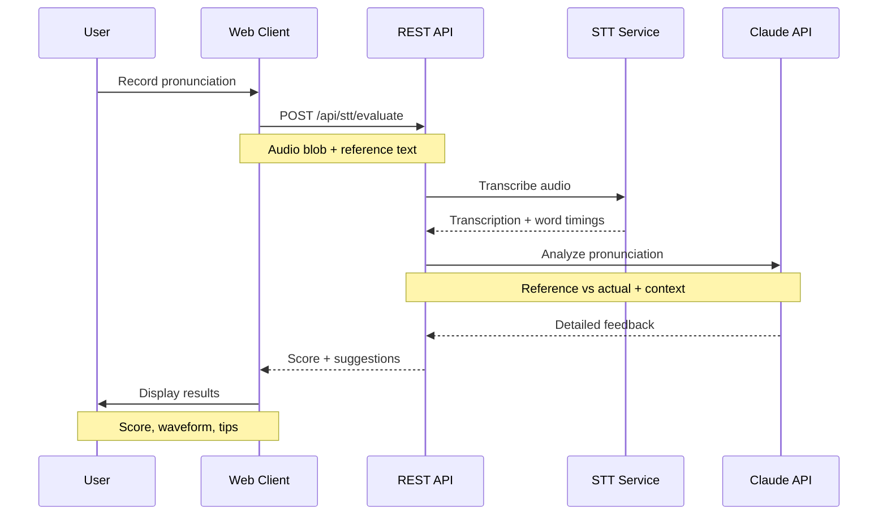
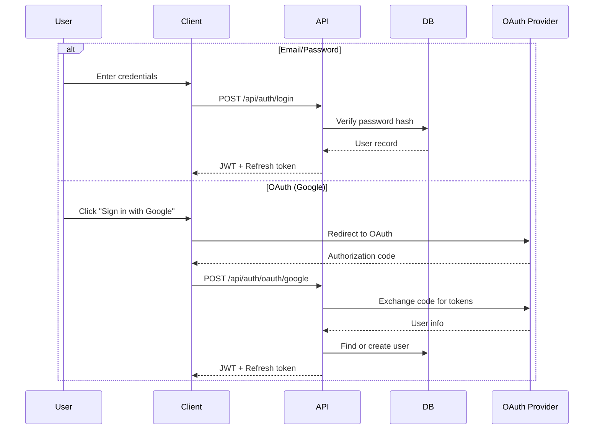
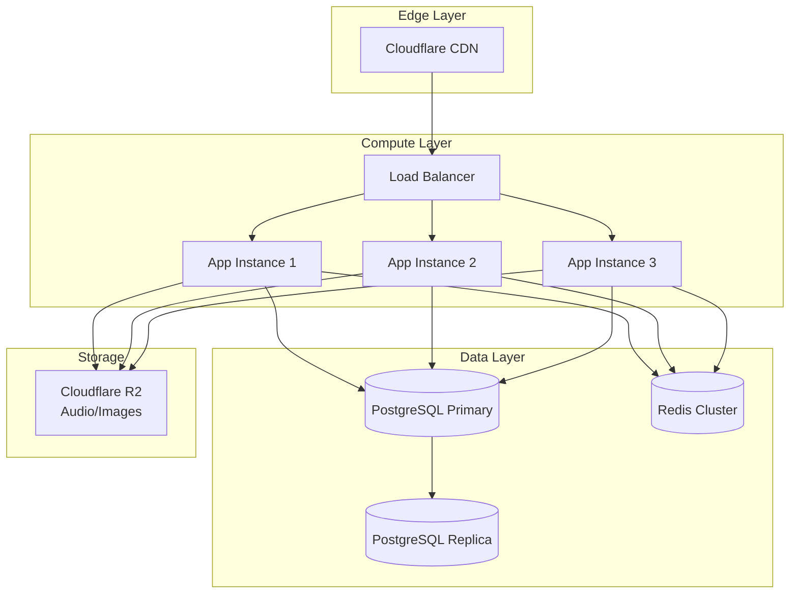

# System Architecture

## 1. Design Philosophy

### Core Principles

1. **Let LLM Handle It** - Avoid hardcoding domain-specific templates; pass natural language to AI
2. **Privacy First** - End-to-end encryption for user content; personal use only
3. **Offline Capable** - PWA support with service worker caching for audio playback
4. **Modular Design** - Reinhardt's composable architecture enables feature isolation
5. **API-Driven** - External services abstracted behind unified interfaces

### Rust + Reinhardt Benefits

- **Type Safety** - Compile-time guarantees reduce runtime errors
- **Performance** - Zero-cost abstractions, efficient memory management
- **Full-Stack** - Single language for backend and WASM frontend
- **Composable** - Mix and match Reinhardt crates as needed

---

## 2. System Component Diagram



---

## 3. Reinhardt Component Architecture

### 3.1 reinhardt-db (ORM Layer)

Database abstraction using SeaQuery + sqlx for type-safe queries.

```rust
use reinhardt_db::prelude::*;

#[derive(Model)]
#[model(table_name = "books")]
pub struct Book {
    #[pk]
    pub id: Uuid,
    pub user_id: Uuid,
    pub title: String,
    pub source_language: String,
    pub target_language: String,
    pub total_pages: i32,
    #[auto_now_add]
    pub created_at: DateTime<Utc>,
    #[auto_now]
    pub updated_at: DateTime<Utc>,
}

impl Book {
    pub async fn find_by_user(
        conn: &DatabaseConnection,
        user_id: Uuid,
    ) -> Result<Vec<Self>, DbError> {
        Self::query()
            .filter(BookColumn::UserId.eq(user_id))
            .order_by(BookColumn::CreatedAt, Order::Desc)
            .all(conn)
            .await
    }
}
```

### 3.2 reinhardt-pages (Frontend Layer)

WASM + SSR reactive framework inspired by Leptos/Solid.js.

```rust
use reinhardt_pages::prelude::*;

#[component]
pub fn LearningPage(book_id: Uuid) -> impl IntoView {
    let (page_index, set_page_index) = create_signal(0);
    let pages = create_resource(
        move || book_id,
        |id| async move { fetch_pages(id).await }
    );

    view! {
        <div class="learning-container">
            <Suspense fallback=|| view! { <LoadingSpinner/> }>
                {move || pages.get().map(|p| view! {
                    <PageViewer
                        page=p[page_index()]
                        on_next=move |_| set_page_index.update(|i| *i += 1)
                    />
                })}
            </Suspense>
        </div>
    }
}
```

### 3.3 reinhardt-rest (API Layer)

Django-inspired ViewSets with automatic serialization.

```rust
use reinhardt_rest::prelude::*;

#[derive(Serialize, Deserialize)]
pub struct BookSerializer {
    pub id: Uuid,
    pub title: String,
    pub source_language: String,
    pub target_language: String,
    pub total_pages: i32,
    pub created_at: DateTime<Utc>,
}

#[viewset]
impl BookViewSet {
    type Model = Book;
    type Serializer = BookSerializer;

    #[action(detail = false, methods = ["GET"])]
    async fn list(&self, request: Request) -> Response {
        let user = request.user()?;
        let books = Book::find_by_user(&self.db, user.id).await?;
        Response::json(books)
    }

    #[action(detail = false, methods = ["POST"])]
    async fn create(&self, request: Request) -> Response {
        let user = request.user()?;
        let payload: CreateBookRequest = request.json().await?;
        let book = Book::create(&self.db, user.id, payload).await?;
        Response::created(book)
    }

    #[action(detail = true, methods = ["GET"])]
    async fn retrieve(&self, request: Request, id: Uuid) -> Response {
        let book = Book::find_by_id(&self.db, id).await?;
        self.check_permission(&request, &book)?;
        Response::json(book)
    }
}
```

### 3.4 reinhardt-auth (Authentication Layer)

Multiple authentication strategies with middleware support.

```rust
use reinhardt_auth::prelude::*;

#[derive(Clone)]
pub struct AuthConfig {
    pub jwt_secret: String,
    pub token_expiry: Duration,
    pub refresh_expiry: Duration,
}

// Middleware configuration
pub fn configure_auth(app: &mut App, config: AuthConfig) {
    app.middleware(JwtAuthMiddleware::new(config.clone()));
    app.middleware(SessionMiddleware::new(RedisBackend::new()));
}

// Protected route example
#[get("/api/me")]
#[authenticated]
async fn get_current_user(user: AuthenticatedUser) -> Response {
    Response::json(UserSerializer::from(user))
}
```

### 3.5 reinhardt-websockets (Real-time Layer)

WebSocket support for Teacher Mode streaming.

```rust
use reinhardt_websockets::prelude::*;

#[websocket("/ws/teacher/{book_id}")]
pub async fn teacher_mode_handler(
    ws: WebSocket,
    book_id: Uuid,
    user: AuthenticatedUser,
) -> Result<(), WsError> {
    let (tx, rx) = ws.split();

    let session = TeacherSession::new(book_id, user.id);

    // Handle incoming commands (pause, resume, skip, settings)
    let cmd_handler = spawn(handle_commands(rx, session.clone()));

    // Stream audio and page updates
    let stream_handler = spawn(stream_lesson(tx, session));

    tokio::select! {
        _ = cmd_handler => {},
        _ = stream_handler => {},
    }

    Ok(())
}

#[derive(Serialize)]
#[serde(tag = "type")]
enum TeacherEvent {
    PageChange { page_index: i32, content: String },
    AudioChunk { data: Vec<u8>, page_index: i32 },
    SessionEnd { completed_pages: i32 },
}
```

---

## 4. Data Flow Diagrams

### 4.1 Book Upload & OCR Flow



### 4.2 Teacher Mode Flow



### 4.3 Pronunciation Evaluation Flow



---

## 5. External Service Integration Patterns

### 5.1 Unified API Client Pattern

All external services are abstracted behind trait interfaces for testability.

```rust
// Trait definition
#[async_trait]
pub trait OcrProvider: Send + Sync {
    async fn extract_text(&self, image: &[u8]) -> Result<OcrResult, OcrError>;
    async fn extract_text_pdf(&self, pdf: &[u8]) -> Result<Vec<OcrResult>, OcrError>;
}

// Google Vision implementation
pub struct GoogleVisionClient {
    api_key: String,
    http_client: reqwest::Client,
}

#[async_trait]
impl OcrProvider for GoogleVisionClient {
    async fn extract_text(&self, image: &[u8]) -> Result<OcrResult, OcrError> {
        // Implementation
    }
}

// Azure implementation
pub struct AzureVisionClient { /* ... */ }

#[async_trait]
impl OcrProvider for AzureVisionClient { /* ... */ }

// Dependency injection
#[inject]
async fn process_upload(
    ocr: Arc<dyn OcrProvider>,
    db: DatabaseConnection,
    payload: UploadPayload,
) -> Result<Book, ProcessError> {
    let results = ocr.extract_text_pdf(&payload.data).await?;
    // ...
}
```

### 5.2 Circuit Breaker Pattern

External API calls use circuit breakers for resilience.

```rust
use circuit_breaker::CircuitBreaker;

pub struct ResilientOcrClient {
    provider: Arc<dyn OcrProvider>,
    circuit: CircuitBreaker,
}

impl ResilientOcrClient {
    pub async fn extract_text(&self, image: &[u8]) -> Result<OcrResult, OcrError> {
        self.circuit
            .call(|| self.provider.extract_text(image))
            .await
            .map_err(|e| match e {
                CircuitError::Open => OcrError::ServiceUnavailable,
                CircuitError::Inner(e) => e,
            })
    }
}
```

### 5.3 Cost Management

API usage is tracked and rate-limited per user tier.

```rust
#[derive(Clone)]
pub struct UsageTracker {
    redis: RedisPool,
}

impl UsageTracker {
    pub async fn check_quota(
        &self,
        user_id: Uuid,
        service: ApiService,
        units: u32,
    ) -> Result<(), QuotaError> {
        let key = format!("quota:{}:{}:{}", user_id, service, today());
        let current: u32 = self.redis.get(&key).await.unwrap_or(0);
        let limit = self.get_limit(user_id, service).await;

        if current + units > limit {
            return Err(QuotaError::Exceeded { current, limit });
        }

        self.redis.incr(&key, units).await?;
        Ok(())
    }
}
```

---

## 6. Security Architecture

### 6.1 Authentication Flow



### 6.2 Data Encryption

- **At Rest**: PostgreSQL with AES-256 encryption for sensitive fields
- **In Transit**: TLS 1.3 for all connections
- **Book Content**: E2E encryption using user-derived keys

```rust
use aes_gcm::{Aes256Gcm, Key, Nonce};

pub struct ContentEncryption {
    cipher: Aes256Gcm,
}

impl ContentEncryption {
    pub fn from_user_key(user_key: &[u8]) -> Self {
        let key = Key::<Aes256Gcm>::from_slice(user_key);
        Self {
            cipher: Aes256Gcm::new(key),
        }
    }

    pub fn encrypt(&self, plaintext: &[u8], nonce: &[u8; 12]) -> Vec<u8> {
        let nonce = Nonce::from_slice(nonce);
        self.cipher.encrypt(nonce, plaintext).expect("encryption failed")
    }
}
```

---

## 7. Deployment Architecture

### 7.1 Development (Podman)

```yaml
# compose.yaml
services:
  app:
    build: .
    ports:
      - "8080:8080"
    environment:
      - DATABASE_URL=postgresql://hailango:password@db:5432/hailango
      - REDIS_URL=redis://redis:6379
    depends_on:
      - db
      - redis

  db:
    image: postgres:16
    volumes:
      - pgdata:/var/lib/postgresql/data
    environment:
      POSTGRES_DB: hailango
      POSTGRES_USER: hailango
      POSTGRES_PASSWORD: password

  redis:
    image: redis:7
    volumes:
      - redisdata:/data

volumes:
  pgdata:
  redisdata:
```

### 7.2 Production (Future)



---

## References

- [Reinhardt Framework](https://github.com/kent8192/reinhardt-web)
- [SeaQuery Documentation](https://www.sea-ql.org/SeaQuery/)
- [Requirements Definition](../requirements_definition.md)
- [Database Schema](database_schema.md)
- [API Specification](api_specification.md)
